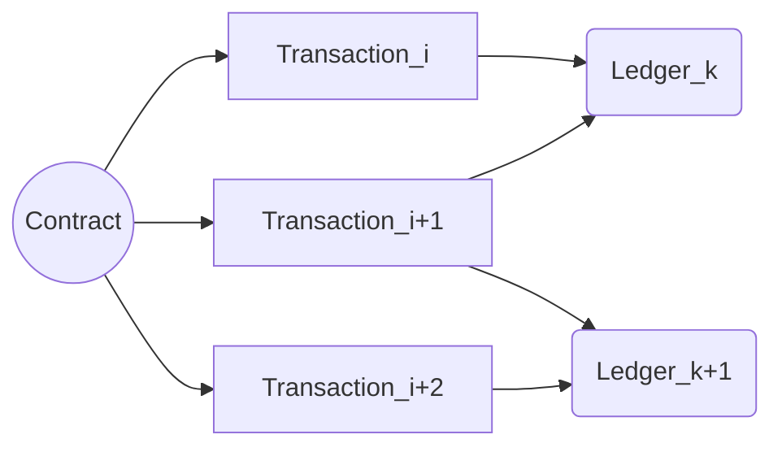

# Jetmint
Jetmint是一个离散的时变系统。Jetmint系统中的所有操作以合约Contract的形式表示，则系统的状态迁移是由Contract触发的。
$$
S_t\stackrel{Contract}\Longrightarrow S_{t+1} （1）         
$$
Contract是具有完整性、一致性的合约。Contract包括多个交易Transaction。
$$
Contract\supset\{Transaction_i,Transaction_{i+1},...\}   (2)
$$
一组Transaction生成一个账本Ledger,
$$
\{Transaction_ k,...\}\rightarrow Ledger_k     (3)
$$
Contract,Transaction,Ledger的关系如图所示。

从而公式（1）可以表示为
$$
S_t\stackrel{Transaction}\Longrightarrow S_{t+1} （4）
$$
并得到如下迁移过程：
$$
Ledger_i|S_t\stackrel{Transaction}\Longrightarrow...\stackrel{Transaction}\Longrightarrow Ledgre_{i+k}|S_{t+k}     （5）
$$
Ledger的变化过程直接体现在区块链上。
## Power of Distribution(PoD)
基于分发的共识协议，系统激励节点分发挖矿，挖矿得到激励后，触发状态迁移。

483574875
安全性

可用性
